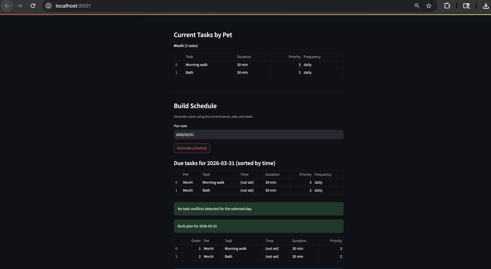

# PawPal+ (Module 2 Project)

You are building **PawPal+**, a Streamlit app that helps a pet owner plan care tasks for their pet.

## Scenario

A busy pet owner needs help staying consistent with pet care. They want an assistant that can:

- Track pet care tasks (walks, feeding, meds, enrichment, grooming, etc.)
- Consider constraints (time available, priority, owner preferences)
- Produce a daily plan and explain why it chose that plan

Your job is to design the system first (UML), then implement the logic in Python, then connect it to the Streamlit UI.

## What you will build

Your final app should:

- Let a user enter basic owner + pet info
- Let a user add/edit tasks (duration + priority at minimum)
- Generate a daily schedule/plan based on constraints and priorities
- Display the plan clearly (and ideally explain the reasoning)
- Include tests for the most important scheduling behaviors

## Getting started

### Setup

```bash
python -m venv .venv
source .venv/bin/activate  # Windows: .venv\Scripts\activate
pip install -r requirements.txt
```

### Suggested workflow

1. Read the scenario carefully and identify requirements and edge cases.
2. Draft a UML diagram (classes, attributes, methods, relationships).
3. Convert UML into Python class stubs (no logic yet).
4. Implement scheduling logic in small increments.
5. Add tests to verify key behaviors.
6. Connect your logic to the Streamlit UI in `app.py`.
7. Refine UML so it matches what you actually built.

## Screenshots



## Features

PawPal+ implements intelligent scheduling algorithms to optimize pet care planning:

### 1. **Chronological Task Sorting**
- Algorithm: Parses task scheduled times (`HH:MM` format) and sorts in ascending order
- Tasks without scheduled times are placed at day's end (23:59)
- Enables clear visual ordering of the daily agenda

### 2. **Priority-Based Task Prioritization**
- Algorithm: Two-tier sort by negative priority (`-priority`) then duration
- Higher priority tasks (`priority=3`) are scheduled before lower priority tasks (`priority=1`)
- Within same priority, shorter tasks are preferred for better schedule flexibility
- Greedy packing: fits as many high-priority tasks as possible within the owner's daily time budget

### 3. **Overlapping Conflict Detection**
- Algorithm: O(n²) interval-overlap check on sorted task list
- Compares task time ranges: if `task_i.start < task_j.end` and `task_j.start < task_i.end`, conflict flagged
- Returns conflicting task pairs with pet names and times for UI display
- Prevents accidental double-booking of pet care activities

### 4. **Recurring Task Generation**
- Algorithm: Upon completion, daily/weekly tasks auto-spawn next occurrence
- Daily tasks: create new instance 1 day ahead (using Python `timedelta`)
- Weekly tasks: create new instance 7 days ahead
- Task ID includes completion date stamp (e.g., `daily-feed_2026-03-31`) for traceability
- Preserves frequency, priority, and description; resets completion status

### 5. **Multi-Criteria Task Filtering**
- Filter by pet name (case-insensitive)
- Filter by completion status (completed/pending)
- Filter by target date (due date range checking)
- Supports combining filters for targeted task lists

### 6. **Time Budget Enforcement**
- Calculates total task duration and compares against owner's daily time budget
- Excludes tasks that exceed remaining capacity
- Returns feasible subset of tasks within time constraints

## Smarter Scheduling

The PawPal+ scheduler now includes advanced features for better pet care planning:

- **Time-based sorting**: Tasks can be sorted by scheduled time using `Scheduler.sort_by_time()`.
- **Flexible filtering**: Filter tasks by pet name, completion status, or due date with `Scheduler.filter_tasks()`.
- **Recurring task support**: Daily and weekly tasks automatically create new instances for future occurrences when marked complete, using Python's `timedelta` for accurate date calculations.
- **Conflict detection**: Detects overlapping tasks between pets or within the same pet, providing warnings without crashing the program.

These features make the scheduler more efficient and user-friendly for busy pet owners.
## Testing PawPal+

To run tests:

```bash
python -m pytest
```

Current tests cover:

- Task completion and task list additions
- Sorting tasks correctly by scheduled time
- Recurring daily tasks generating the next occurrence upon completion
- Conflict detection for overlapping task times

**Confidence Level:** ⭐⭐⭐⭐⭐ (5/5) - all current tests pass successfully and the core scheduling behaviors are covered.
