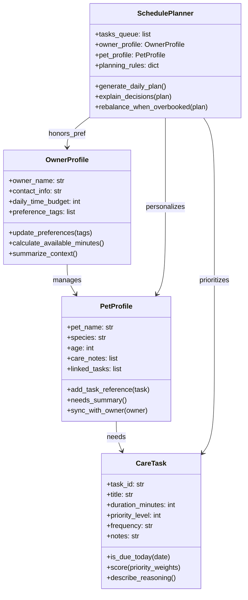

# PawPal+ Project Reflection

## 1. System Design

Core user actions that must be supported in PawPal+:
- Capture basic owner and pet profiles (name, species, care preferences) so every plan is grounded in the household's real context before any scheduling happens.
- Add or edit pet care tasks with duration and priority details (walks, feedings, meds, enrichment, grooming) to keep an up-to-date backlog of responsibilities the scheduler can pull from.
- Generate a daily plan that sequences the selected tasks within the owner's available time and explains why each activity was scheduled, giving the user a clear agenda they can act on.

Brainstormed objects, attributes, and behaviors for the pet care app:
- **OwnerProfile**
  - Attributes: owner_name, contact_info, daily_time_budget, preference_tags.
  - Methods: `update_preferences()`, `calculate_available_minutes()`, `summarize_context()`.
- **PetProfile**
  - Attributes: pet_name, species, age, care_notes, linked_tasks.
  - Methods: `add_task_reference()`, `needs_summary()`, `sync_with_owner()`.
- **CareTask**
  - Attributes: task_id, title, duration_minutes, priority_level, frequency, notes.
  - Methods: `is_due_today()`, `score(priority_weights)`, `describe_reasoning()`.
- **SchedulePlanner**
  - Attributes: tasks_queue, owner_profile, pet_profile, planning_rules.
  - Methods: `generate_daily_plan()`, `explain_decisions()`, `rebalance_when_overbooked()`.

I am designing a pet care app with these four classes (OwnerProfile, PetProfile, CareTask, SchedulePlanner) so the scheduling logic stays organized and traceable.

After brainstorming I asked Copilot for a Mermaid.js class diagram reflecting the attributes and methods above:

**a. Initial design**

- Briefly describe your initial UML design.
- What classes did you include, and what responsibilities did you assign to each?

**b. Design changes**

- Did your design change during implementation?
- If yes, describe at least one change and why you made it.

---

## 2. Scheduling Logic and Tradeoffs

**a. Constraints and priorities**

- What constraints does your scheduler consider (for example: time, priority, preferences)?
- How did you decide which constraints mattered most?

**b. Tradeoffs**

- Describe one tradeoff your scheduler makes.
- Why is that tradeoff reasonable for this scenario?

---

## 3. AI Collaboration

**a. How you used AI**

- How did you use AI tools during this project (for example: design brainstorming, debugging, refactoring)?
- What kinds of prompts or questions were most helpful?

**b. Judgment and verification**

- Describe one moment where you did not accept an AI suggestion as-is.
- How did you evaluate or verify what the AI suggested?

---

## 4. Testing and Verification

**a. What you tested**

- What behaviors did you test?
- Why were these tests important?

**b. Confidence**

- How confident are you that your scheduler works correctly?
- What edge cases would you test next if you had more time?

---

## 5. Reflection

**a. What went well**

- What part of this project are you most satisfied with?

**b. What you would improve**

- If you had another iteration, what would you improve or redesign?

**c. Key takeaway**

- What is one important thing you learned about designing systems or working with AI on this project?
