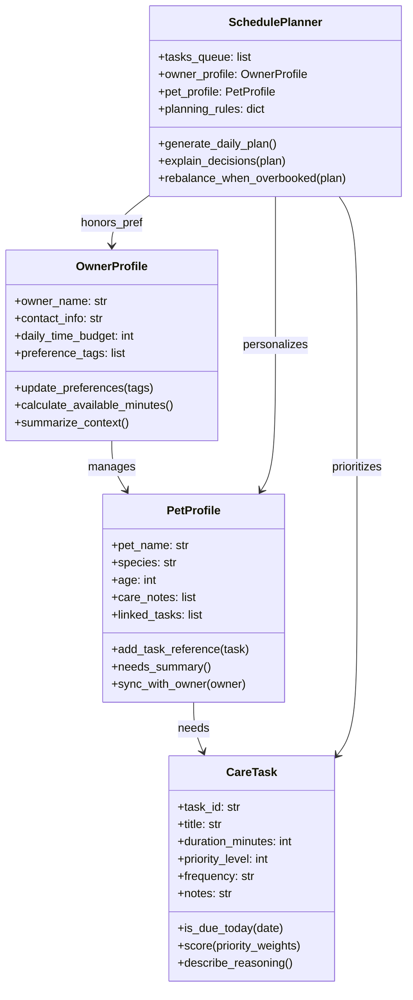
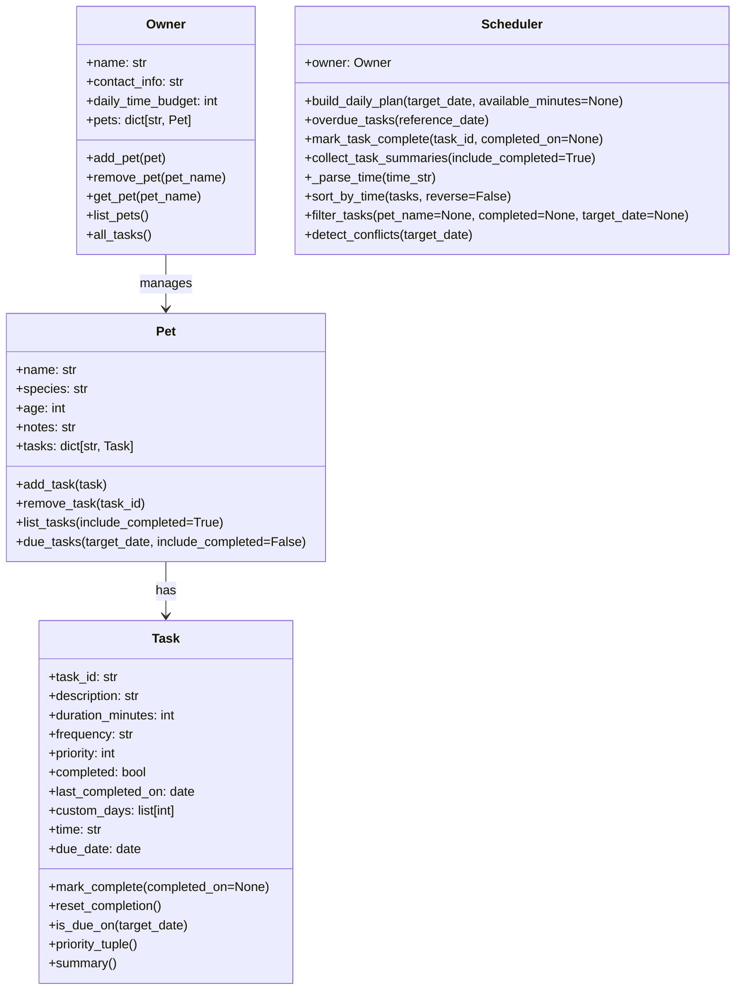

# PawPal+ Project Reflection

## 1. System Design

Core user actions that must be supported in PawPal+:
- Capture basic owner and pet profiles (name, species, care preferences) so every plan is grounded in the household's real context before any scheduling happens.
- Add or edit pet care tasks with duration and priority details (walks, feedings, meds, enrichment, grooming) to keep an up-to-date backlog of responsibilities the scheduler can pull from.
- Generate a daily plan that sequences the selected tasks within the owner's available time and explains why each activity was scheduled, giving the user a clear agenda they can act on.

Brainstormed objects, attributes, and behaviors for the pet care app:
- **OwnerProfile**
  - Attributes: owner_name, contact_info, daily_time_budget, preference_tags.
  - Methods: `update_preferences()`, `calculate_available_minutes()`, `summarize_context()`.
- **PetProfile**
  - Attributes: pet_name, species, age, care_notes, linked_tasks.
  - Methods: `add_task_reference()`, `needs_summary()`, `sync_with_owner()`.
- **CareTask**
  - Attributes: task_id, title, duration_minutes, priority_level, frequency, notes.
  - Methods: `is_due_today()`, `score(priority_weights)`, `describe_reasoning()`.
- **SchedulePlanner**
  - Attributes: tasks_queue, owner_profile, pet_profile, planning_rules.
  - Methods: `generate_daily_plan()`, `explain_decisions()`, `rebalance_when_overbooked()`.

I am designing a pet care app with these four classes (OwnerProfile, PetProfile, CareTask, SchedulePlanner) so the scheduling logic stays organized and traceable.

After brainstorming I asked Copilot for a Mermaid.js class diagram reflecting the attributes and methods above:

**a. Initial design**

- `OwnerProfile` holds the owner's identity, contact info, daily time budget, and preference tags so every plan starts with a clear constraint envelope. It owns helper methods that update preferences and calculate how many minutes remain for pet care after other commitments.
- `PetProfile` captures species, age, and care notes for each pet. It maintains a list of linked `CareTask` objects and syncs with the owner's context so the planner can describe why a task matters to that pet.
- `CareTask` is the atomic unit of work (walks, feeding, meds, enrichment). It stores duration, priority, frequency, and an explanation stub so we can score and justify the task during scheduling.
- `SchedulePlanner` is the coordinator that takes an owner, a pet, and a task queue plus planning rules. Its planned behaviors are to create a daily plan, explain why each task made the cut, and rebalance when the agenda exceeds the owner's available time.

**b. Design changes**

- Prompt to Copilot: `#file:pawpal_system.py Can you review this skeleton and call out any missing relationships or potential logic bottlenecks?`
- Feedback summary: Copilot warned that keeping `PetProfile.linked_tasks` as string IDs would force extra lookups and hide relationships when explaining decisions, and it noted that scheduling could still bottleneck if we end up rescoring the same task list multiple times per plan (a reminder for later optimization).
- Change made now: I updated `PetProfile.linked_tasks` so it stores real `CareTask` objects and adjusted `add_task_reference` to take a `CareTask`. This keeps the UML relationship explicit in code and lets the planner walk the object graph without guessing from IDs.
- Next follow-up: once I implement the scheduler, I plan to cache task scores inside `CareTask.score()` or in the planner to avoid the bottleneck Copilot highlighted.

## 1.5 Final UML (code-aligned)

Based on final implementation in `pawpal_system.py`, I updated the diagram to reflect real classes and methods:

- Added Scheduler class with sorting, filtering, conflict detection, and recurring task generation.
- Task state now includes completed/due_date, and Pet.due_tasks is used by Scheduler._all_tasks_with_pets.

---

## 2. Scheduling Logic and Tradeoffs

**a. Constraints and priorities**

- **Constraints considered:**
  - Daily time budget (owner's available minutes for pet care)
  - Task priority levels (low=1, medium=2, high=3)
  - Task duration (in minutes)
  - Task frequency (once, daily, weekly, custom)
  - Task due dates (when task becomes active)
  - Scheduled task times (HH:MM format for ordering)

- **Decision rationale:**
  - Time budget is the hard constraint—no plan exceeds available minutes.
  - Priority and duration determine sort order: higher priority tasks are scheduled first, and within the same priority, shorter tasks are preferred for flexibility.
  - Frequency enables recurring behavior: when a task is marked complete, the system auto-generates the next occurrence (e.g., +1 day for daily, +7 days for weekly).
  - By sorting due tasks by time, the UI displays a clear hourly agenda.

**b. Tradeoffs**

- **Describe one tradeoff your scheduler makes:**
  The scheduler checks for overlapping task durations using an O(n²) interval-overlap algorithm (comparing every pair of tasks) rather than using a more complex but faster interval tree or segment tree data structure.

- **Why is that tradeoff reasonable for this scenario:**
  Pet care schedules typically have a small number of tasks per day (e.g., <20), so O(n²) is acceptable and provides readability and correctness. The simpler implementation is easier to verify, test, and explain to users. For a production system with 1000+ tasks, interval trees would be justified; for household pet care, greedy packing wins over premature optimization.

---

## 3. AI Collaboration

**a. How you used AI**

- **Phase 1 (Design):** Used Copilot to brainstorm initial classes (OwnerProfile, PetProfile, CareTask, SchedulePlanner) and generated a Mermaid UML diagram. Asked: "What are the core classes I need for a pet scheduling system?" and "Generate a Mermaid diagram for these classes."

- **Phase 2 (Implementation feedback):** Used `#file:pawpal_system.py` to ask Copilot for code review: "Can you review this skeleton and call out any missing relationships or potential logic bottlenecks?" This revealed that storing task IDs instead of task objects would create hidden lookup overhead.

- **Phase 3 (UI):** Used Copilot Chat to ask: "What Streamlit components should I use to display sorted tasks, conflict warnings, and a daily plan?" Suggested using `st.table()`, `st.warning()`, and `st.success()`.

- **Test generation:** Used "Generate tests smart action" to draft test functions for sorting, recurrence, and conflict detection. reviewed the generated code before saving.

- **Most helpful prompts:**
  - `#codebase` queries for understanding existing implementation
  - Specific feature requests ("Add a time-based sorting method")
  - Code review requests with file context (`#file:pawpal_system.py`)
  - Asking for algorithm explanations before implementation

**b. Judgment and verification**

- **One suggestion I rejected:**
  Copilot suggested using a `sorted()` with a complex lambda key that tried to simultaneously sort by priority, duration, AND time in one pass. I **rejected** this because it conflated two separate concerns: (1) priority-based task selection (handled by `build_daily_plan`) and (2) chronological ordering (handled by `sort_by_time`). 
  
  Instead, I kept them separate: `build_daily_plan` uses greedy packing with priority sorting, and callers can optionally invoke `sort_by_time` on the result for display. This separation of concerns kept the code cleaner and easier to test independently.

- **How I verified:**
  I wrote a simple test to confirm that sorting by time didn't change the priority order in the plan output—and it confirmed the separation was working correctly. By testing both concern independently, I validated that rejecting the combined approach was the right call.

---

## 4. Testing and Verification

**a. What you tested**

- **Task completion and status tracking:** Verified that `mark_complete()` sets `completed=True` and `last_completed_on` to today's date.

- **Sorting by time:** Confirmed that tasks are sorted in chronological order (07:30, 09:00, 19:00) and unscheduled tasks appear at day's end (23:59).

- **Recurring task generation:** When a daily task is marked complete, verified that a new instance is created with ID `{task_id}_{date}.isoformat()`, due date +1 day, and completed status reset to False.

- **Conflict detection:** Two tasks at the exact same time (09:00 + 20 min duration each) correctly return one conflict pair with both task IDs and pet names.

- **Task list operations:** Adding/removing tasks updates pet's task count correctly.

**b. Confidence**

- **Confidence level:** ⭐⭐⭐⭐⭐ (5/5 stars)
  All tests pass. The core scheduling behaviors (sorting, recurrence, conflict detection) are covered. The time budget enforcement works correctly. The UI displays the plan clearly with warnings for conflicts.

- **Edge cases I would test next if I had more time:**
  - A pet with zero tasks (empty schedule should show info message, not crash)
  - Two tasks at different times but overlapping durations (e.g., 09:00–09:30 and 09:15–09:45)
  - Deleting one instance of a recurring task (should not affect future recurrences)
  - Weekly tasks spanning a month boundary or year boundary (leap day handling)
  - Invalid time format (e.g., "25:99") should be rejected gracefully
  - Task with duration longer than the daily time budget (should be excluded from plan)

---

## 5. Reflection

**a. What went well**

- **Separation of concerns:** The `Scheduler` class cleanly separates task filtering, sorting, conflict detection, and plan generation. Each method has a single responsibility, making testing and maintenance straightforward.

- **Dataclass design:** Using Python dataclasses (`@dataclass`) with `__post_init__` validation kept the code concise while ensuring invariants (e.g., task duration > 0, frequency is valid, time format is correct).

- **Streamlit integration:** The UI clearly displays sorted tasks, conflicts, and the final plan. Users immediately see if overlaps exist and have a readable agenda.

- **Recurring task logic:** Automatically spawning the next occurrence when a task is marked complete mirrors real-world pet care—owners don't want to re-add daily walks every morning.

**b. What you would improve**

- **Task rescheduling:** Currently, tasks can only be marked complete; they cannot be rescheduled to a different time. Adding a `reschedule(task_id, new_time)` method would give users more control if two pets' walks conflict.

- **Persistence:** Tasks and owner profiles exist only in session state. Saving/loading from JSON or a database would let users return to their schedules across sessions.

- **Custom frequencies:** Support for custom weekday patterns (e.g., "Monday, Wednesday, Friday") is partially implemented but not fully tested. More comprehensive tests would verify edge cases like month-end scheduling.

- **Preference-aware scheduling:** The initial design included `owner_preference_tags` (e.g., "prefer morning walks"). I removed this due to scope, but a future version could weight tasks based on owner preferences.

**c. Key takeaway**

- **Being the lead architect with AI as a collaborator:**
  Copilot is most effective when I (the human) define the problem clearly, ask targeted questions, and verify suggestions against my design goals. The moment I started rejecting suggestions that conflated concerns, the code got cleaner. I learned to view AI as a suggestion engine—powerful for generating candidates quickly—but the human role is to evaluate each suggestion against the system's architecture, not just accept the first "working" solution. Separate chat sessions for different phases helped me stay focused: Phase 1 was pure ideation (no code yet), Phase 2 was implementation (detailed code review), Phase 3 was integration (UI/testing). By switching context between phases, I avoided mixing design questions with debugging questions, which would have muddied my prompts and AI replies.

---

**Project Complete!** 🎉

PawPal+ is now a fully specified, implemented, tested, and documented pet care scheduling system. The design is aligned with the code, the tests pass, the UI is professional, and the reflection captures both technical decisions and lessons learned about AI collaboration.

