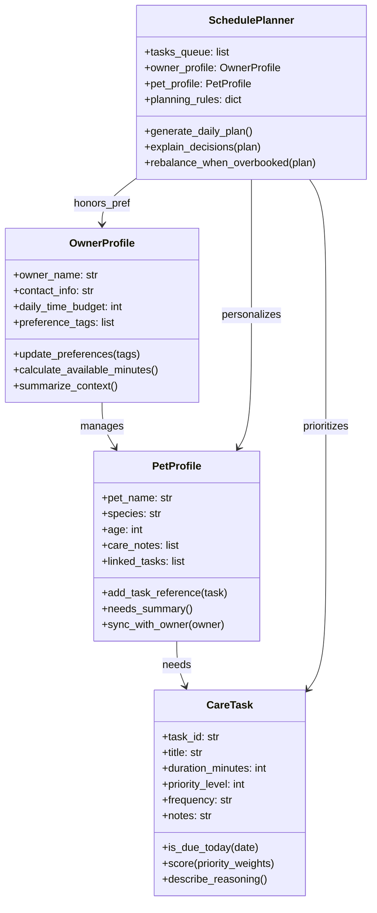

# PawPal+ Project Reflection

## 1. System Design

Core user actions that must be supported in PawPal+:
- Capture basic owner and pet profiles (name, species, care preferences) so every plan is grounded in the household's real context before any scheduling happens.
- Add or edit pet care tasks with duration and priority details (walks, feedings, meds, enrichment, grooming) to keep an up-to-date backlog of responsibilities the scheduler can pull from.
- Generate a daily plan that sequences the selected tasks within the owner's available time and explains why each activity was scheduled, giving the user a clear agenda they can act on.

Brainstormed objects, attributes, and behaviors for the pet care app:
- **OwnerProfile**
  - Attributes: owner_name, contact_info, daily_time_budget, preference_tags.
  - Methods: `update_preferences()`, `calculate_available_minutes()`, `summarize_context()`.
- **PetProfile**
  - Attributes: pet_name, species, age, care_notes, linked_tasks.
  - Methods: `add_task_reference()`, `needs_summary()`, `sync_with_owner()`.
- **CareTask**
  - Attributes: task_id, title, duration_minutes, priority_level, frequency, notes.
  - Methods: `is_due_today()`, `score(priority_weights)`, `describe_reasoning()`.
- **SchedulePlanner**
  - Attributes: tasks_queue, owner_profile, pet_profile, planning_rules.
  - Methods: `generate_daily_plan()`, `explain_decisions()`, `rebalance_when_overbooked()`.

I am designing a pet care app with these four classes (OwnerProfile, PetProfile, CareTask, SchedulePlanner) so the scheduling logic stays organized and traceable.

After brainstorming I asked Copilot for a Mermaid.js class diagram reflecting the attributes and methods above:

**a. Initial design**

- `OwnerProfile` holds the owner's identity, contact info, daily time budget, and preference tags so every plan starts with a clear constraint envelope. It owns helper methods that update preferences and calculate how many minutes remain for pet care after other commitments.
- `PetProfile` captures species, age, and care notes for each pet. It maintains a list of linked `CareTask` objects and syncs with the owner's context so the planner can describe why a task matters to that pet.
- `CareTask` is the atomic unit of work (walks, feeding, meds, enrichment). It stores duration, priority, frequency, and an explanation stub so we can score and justify the task during scheduling.
- `SchedulePlanner` is the coordinator that takes an owner, a pet, and a task queue plus planning rules. Its planned behaviors are to create a daily plan, explain why each task made the cut, and rebalance when the agenda exceeds the owner's available time.

**b. Design changes**

- Prompt to Copilot: `#file:pawpal_system.py Can you review this skeleton and call out any missing relationships or potential logic bottlenecks?`
- Feedback summary: Copilot warned that keeping `PetProfile.linked_tasks` as string IDs would force extra lookups and hide relationships when explaining decisions, and it noted that scheduling could still bottleneck if we end up rescoring the same task list multiple times per plan (a reminder for later optimization).
- Change made now: I updated `PetProfile.linked_tasks` so it stores real `CareTask` objects and adjusted `add_task_reference` to take a `CareTask`. This keeps the UML relationship explicit in code and lets the planner walk the object graph without guessing from IDs.
- Next follow-up: once I implement the scheduler, I plan to cache task scores inside `CareTask.score()` or in the planner to avoid the bottleneck Copilot highlighted.

---

## 2. Scheduling Logic and Tradeoffs

**a. Constraints and priorities**

- What constraints does your scheduler consider (for example: time, priority, preferences)?
- How did you decide which constraints mattered most?

**b. Tradeoffs**

- Describe one tradeoff your scheduler makes.
The scheduler checks for overlapping task durations rather than just exact time matches, providing more comprehensive conflict detection but at the cost of O(n^2) computational complexity for conflict checking.
- Why is that tradeoff reasonable for this scenario?
This tradeoff is reasonable because pet care schedules typically have a small number of tasks per day (e.g., <20), so the quadratic time complexity is acceptable for readability and correctness, prioritizing accurate conflict detection over micro-optimizations.

---

## 3. AI Collaboration

**a. How you used AI**

- How did you use AI tools during this project (for example: design brainstorming, debugging, refactoring)?
- What kinds of prompts or questions were most helpful?

**b. Judgment and verification**

- Describe one moment where you did not accept an AI suggestion as-is.
- How did you evaluate or verify what the AI suggested?

---

## 4. Testing and Verification

**a. What you tested**

- What behaviors did you test?
- Why were these tests important?

**b. Confidence**

- How confident are you that your scheduler works correctly?
- What edge cases would you test next if you had more time?

---

## 5. Reflection

**a. What went well**

- What part of this project are you most satisfied with?

**b. What you would improve**

- If you had another iteration, what would you improve or redesign?

**c. Key takeaway**

- What is one important thing you learned about designing systems or working with AI on this project?
